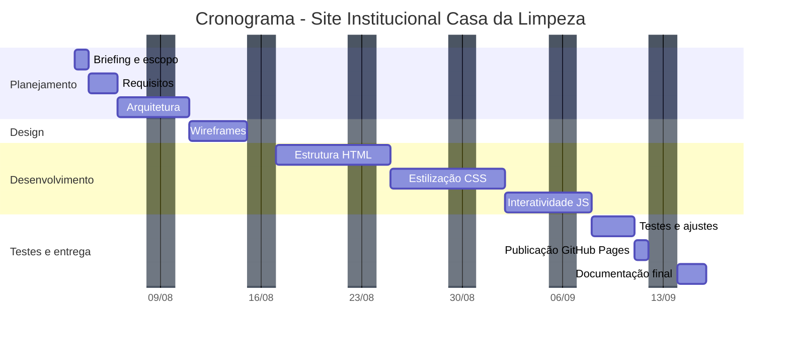

# Casa da Limpeza — Site Institucional

**Status:** Concluído e publicado

Site institucional desenvolvido para a Casa da Limpeza, microempresa local de
Uberlândia-MG, como parte da Atividade Extensionista II do curso de Análise
e Desenvolvimento de Sistemas.

## Acesse o site

[izaamc.github.io/casa-da-limpeza](https://izaamc.github.io/casa-da-limpeza/)

## Sobre o projeto

O projeto tem como objetivo criar uma presença digital para a Casa da Limpeza,
unindo aplicação prática de conhecimentos acadêmicos com impacto real na
comunidade local, através do desenvolvimento de uma solução web funcional
para um pequeno negócio.

## ODS relacionados

- ODS 08 — Trabalho decente e crescimento econômico
- ODS 09 — Indústria, inovação e infraestrutura

## Páginas do site

| Página | Descrição |
|---|---|
| `index.html` | Início — apresentação, marcas, produtos em destaque e contato |
| `sobre.html` | Sobre a empresa, linha do tempo e diferenciais |
| `orcamento.html` | Orçamento empresarial para CNPJ, com formulário de contato |
| `politica-privacidade.html` | Política de privacidade (LGPD) |

## Tecnologias

- HTML5
- CSS3
- JavaScript
- [Web3Forms](https://web3forms.com/) — envio do formulário de orçamento por e-mail, sem backend
- GitHub Pages — hospedagem

## Cronograma



**Início:** 03/08/2026 · **Publicado:** 25/09/2026 · **Prazo final:** 26/09/2026

| Atividade | Duração |
|---|---|
| Briefing e definição do escopo com a cliente | 1 dia |
| Levantamento de objetivos e requisitos | 2 dias |
| Planejamento da arquitetura do site | 3 dias |
| Wireframes e prototipação | 4 dias |
| Desenvolvimento da estrutura HTML | 6 dias |
| Estilização com CSS | 6 dias |
| Implementação de interatividade em JavaScript | 4 dias |
| Testes de usabilidade e responsividade | 3 dias |
| Publicação via GitHub Pages | 1 dia |
| Documentação e relatório final | 2 dias |

## Estrutura do projeto

```
casa-da-limpeza/
├── css/
│   └── style.css                  # Estilização
├── img/
│   ├── marcas/                    # Logos das marcas trabalhadas
│   ├── produtos/                  # Fotos dos produtos em destaque
│   └── ...                        # Logo, ícones, fotos da loja
├── js/
│   └── script.js                  # Interatividade (menu, carrosséis, formulário, cookies)
├── index.html                     # Início
├── sobre.html                     # Sobre a empresa
├── orcamento.html                 # Orçamento empresarial
└── politica-privacidade.html      # Política de privacidade (LGPD)
```

## Preview

O site está no ar em [izaamc.github.io/casa-da-limpeza](https://izaamc.github.io/casa-da-limpeza/).

## Rodar localmente (opcional)

**Download direto**
1. Clique em "Code" → "Download ZIP"
2. Extraia o arquivo e abra o `index.html` no navegador

**Via Git**
```bash
git clone https://github.com/izaamc/casa-da-limpeza.git
cd casa-da-limpeza
```
Depois, abra o arquivo `index.html` no navegador.

---

Projeto acadêmico (Atividade Extensionista II) e portfólio freelance —
Análise e Desenvolvimento de Sistemas.
